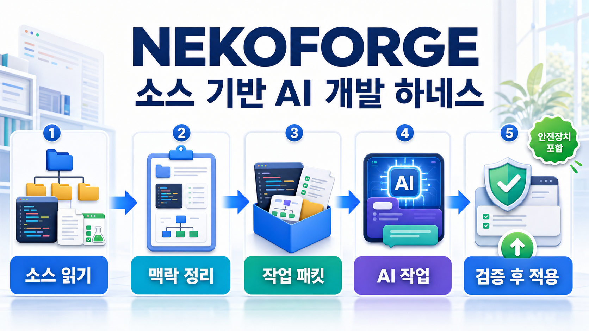

# NEKOFORGE

[](https://github.com/Ps-Neko/NEKOFORGE/actions/workflows/test.yml)
[](LICENSE)
[](https://nodejs.org/)
[](RELEASE-NOTES.md)

> NEKOFORGE는 기존 코드베이스를 재사용 가능한 개발 맥락으로 바꾸어, AI 보조 개발의 생산성과 안정성을 높이는 로컬 개발 하네스입니다.
>
> 프로젝트 구조를 읽고, 작업 맥락을 정리하고, AI 도구에 넘길 실행 단위를 만들며, 최종 변경은 검증 후 적용하도록 합니다.



## 한눈에 보기

```text
기존 소스 -> 맥락 정리 -> 작업 패킷 -> AI 작업 -> 검증 후 적용
```

NEKOFORGE의 주인공은 검수가 아니라 **소스 활용 기반 생산성**입니다. 검증/Gate는 그 흐름의 마지막 안전장치입니다.

## 무엇을 해주나요?

- 현재 프로젝트의 소스, 문서, 테스트, 규칙, 작업 흐름을 읽어 AI가 이해하기 쉬운 맥락으로 정리합니다.
- Claude, Codex, Cursor 같은 AI 도구에 넘길 작업 단위와 프롬프트를 만듭니다.
- 작업 과정을 `SPEC`, `PLAN`, `TASKS`, `worklog`, `REPORT` 같은 증거로 남깁니다.
- 마지막에는 테스트 상태, 규칙, 리뷰 결과를 묶어 변경을 적용해도 되는지 판단합니다.
- 위험하거나 증거가 부족하면 실제 적용 전에 멈춥니다.

## 왜 필요한가요?

AI는 빠르지만, 기존 코드베이스의 구조와 규칙을 항상 잘 기억하지는 못합니다. NEKOFORGE는 프로젝트 맥락을 먼저 정리해 AI 작업 품질을 끌어올리고, 마지막에 안전장치를 붙여 위험한 변경이 그대로 들어가지 않게 합니다.

## NEKOWORK와의 차이

```text
NEKOWORK  = AI가 만든 diff를 검증하는 안전 게이트
NEKOFORGE = 기존 소스와 프로젝트 맥락을 활용해 AI 개발 생산성을 높이고,
            마지막에 NEKOWORK식 검증까지 붙이는 로컬 하네스
```

## 현재 상태

- `v0.5.0-alpha`
- 29개 CLI 명령
- 35개 deterministic rule
- Rule Pack 13종, Skill Pack 13종
- `harness demo productivity` 로 소스 기반 작업 패킷 체험 가능
- `harness demo safety` 로 위험 diff 차단 체험 가능
- 현재는 npm 공개 배포 전 알파 상태입니다.

## 가장 빠른 체험

먼저 격리된 productivity demo로 "기존 소스 -> 맥락 -> 작업 패킷 -> AI 프롬프트" 흐름을 확인합니다.

```bash
$ npm install
$ npm run build
$ node dist/src/cli/index.js demo productivity --clean
```

안전장치가 위험 diff를 막는 장면은 별도 demo로 확인합니다.

```bash
$ node dist/src/cli/index.js demo safety --clean
```

## 실제 프로젝트에서 시작

```bash
$ npm install
$ npm run build
$ node dist/src/cli/index.js doctor
$ node dist/src/cli/index.js init --preset cli-tool
$ node dist/src/cli/index.js self-host --goal "first verdict smoke"
```

전역 alias (`nekoforge` / `harness`) 사용 시 `npm link` 후:

```bash
$ nekoforge doctor
$ nekoforge init --preset cli-tool
$ nekoforge self-host --goal "first verdict smoke"
```

자세한 시작 가이드는 [GETTING-STARTED.md](GETTING-STARTED.md), 예시는 [examples/00-first-verdict](examples/00-first-verdict/) 를 참고하세요.

## 개발자용 전체 흐름 (14단계 + Worker Factory)

```bash
$ nekoforge init --preset backend-api
$ nekoforge ask "<목표 한 줄>"
$ nekoforge context
$ nekoforge spec
$ nekoforge plan
$ nekoforge workers init --profile standard      # init --preset 했으면 생략 가능
$ nekoforge packet TASK-001 --dispatch            # AI 작업 패킷 + worker prompt 생성
$ nekoforge rule-pack audit                      # template 별 required pack 확인
$ nekoforge skill-pack audit                     # template 별 recommended pack 확인
$ nekoforge dispatch TASK-001 --all              # 전체 worker prompt 생성
# (사용자가 각 worker prompt 를 LLM 에 입력해 result.md 작성)
$ nekoforge worker-result import TASK-001 --worker implementation-worker --file impl.md
# ... 다른 worker 들도 import
$ nekoforge worker-result validate TASK-001
$ nekoforge review
$ nekoforge gate                                  # → verdict
$ nekoforge apply --approved                      # PASS/PASS_WITH_WARNINGS 시
```

local checkout (npm link 없이) 에서는 `nekoforge` 대신 `node dist/src/cli/index.js` 또는 `npm run dev --` 사용.

## 30초 명령 시퀀스 (참고용 — 실제 작성 시간 별도)

```bash
$ harness init                            # .harness/ 워크스페이스 만들기
$ harness ask "사용자 로그인 잠금 기능 추가"   # 목표 저장 + clarify 질문
$ harness context                         # 소스 자동 스캔(파일·언어·스크립트·테스트·위험파일) + 도메인/제약 보완
$ harness spec                            # 7문항 강제 답변 → SPEC.md
$ harness plan                            # 작은 task + 테스트 계획
$ harness design --pattern Producer-Reviewer   # 팀 패턴 선택
$ harness policy                          # rules·hooks·context-policy 묶음
$ harness team                            # 실행 routing
$ harness packet TASK-001                 # 소스·스펙·계획을 AI 작업 패킷으로 묶기

# (여기서 IDE/AI 로 실제 코드 변경 작성)

$ harness work TASK-001                   # diff 캡처 + pending patch 격리
$ harness review --adapter codex          # self-review + 외부 어댑터
$ harness gate                            # verdict 산출 → REPORT.md + decision.json
$ harness gate --strict                   # (CI) clean PASS 아니면 non-zero exit
$ harness apply --approved                # verdict + Human Gate 통과 시에만 적용
$ harness export claude                   # (선택) .claude/agents 로 export
```

---

## 무엇이 차단되는가

이 도구가 자동으로 잡는 **35 deterministic rule** (9 security + 4 architecture + 3 design + 4 api-safety + 4 dependency + 3 docs + 4 release-evidence + 4 frontend) — 주요 9종:

| Rule | 잡는 것 | 어떤 verdict |
|---|---|---|
| `secret-fallback` | `process.env.X \|\| "fallback-key"` 같은 하드코딩 fallback | BLOCK |
| `auth-bypass` | `requireAuth()` 제거, `if (true)` bypass, `NODE_ENV !== production` 우회 | BLOCK |
| `test-deletion` | 테스트 파일 삭제 또는 `.skip(` `@Disabled` `t.Skip(` 추가 | BLOCK / NEEDS_HUMAN_REVIEW |
| `no-test-risk` | src 변경 있는데 tests 변경 없음 | PASS_WITH_WARNINGS |
| `dangerous-file-write` | `.env`, CI 워크플로, `auth/`, `Dockerfile`, k8s, Terraform | NEEDS_HUMAN_REVIEW |
| `hook-injection-risk` | `package.json` postinstall, `.husky/`, `.harness/hooks.json` 의 화이트리스트 외 명령 | NEEDS_HUMAN_REVIEW |
| `agent-permission-risk` | 한 agent 가 impl + security 같은 핵심 역할 겸직 | NEEDS_HUMAN_REVIEW |
| `auto-apply-block` | BLOCK / INSUFFICIENT_EVIDENCE 상태에서 apply 시도 | apply 진입 차단 (exit 4) |
| `codex-missing-risk` | 고위험 변경 + 외부 review 부재 | NEEDS_HUMAN_REVIEW / INSUFFICIENT_EVIDENCE |
| (메타) `audit-integrity` | `.harness/audit.jsonl` chain hash / anchor 위변조 | NEEDS_HUMAN_REVIEW |

TypeScript/JavaScript 외에 **Python, Go** 휴리스틱도 포함.

---

## 어떻게 동작하는가

**14단계 공정**을 순서대로 강제. 각 단계는 다른 명령으로만 진행되고, 모두 파일로 증거를 남긴다.

```text
intake → clarify → context → spec → plan
       → harness-design → quality-policy → team
       → work → self-review → codex-review
       → gate → apply → memory
```

**core 가 14개 모듈** (`src/core/<stage>/`) 로 1:1 분리, **`dependency-cruiser` 가 단계 간 직접 호출을 금지**(통신은 항상 `.harness/` artifact 파일을 통해서만). 이 구조가 "단계 한 개가 다른 단계를 대신할 수 없다" 는 본 도구의 핵심 약속을 강제한다.

**Verdict 5종**

```text
PASS              → apply 허용
PASS_WITH_WARNINGS → apply 허용 (warning 발화)
NEEDS_HUMAN_REVIEW → .harness/approval.txt 토큰 매칭 시에만 apply
BLOCK             → apply 거부 (exit 4)
INSUFFICIENT_EVIDENCE → apply 거부 (exit 4) — evidence/schema 위반
```

---

## 왜 이렇게 만들었는가

기존 도구들의 빈틈을 **역할별로 분리해서** 채운다. 단일 제품이 모든 것을 다 하려고 하지 않는다.

| 참고 프로젝트 | NEKOFORGE 에서의 역할 | 단계 위치 |
|---|---|---|
| **Gstack** | 제품 질문 / 스펙 압축 | clarify · spec |
| **Superpowers** | spec-first · plan-first · TDD discipline | spec · plan · work |
| **Everything Claude Code (ECC)** | rules · hooks · context · security 카탈로그 | quality-policy |
| **revfactory/harness** | 도메인 → 팀 아키텍처 설계 | harness-design |
| **OMC** | 멀티 에이전트 실행 routing | team · work |
| **Codex** | 외부 독립 코드 검증 | codex-review |
| **[NEKOWORK](https://github.com/Ps-Neko/NEKOWORK)** | verdict · decision.json · Human Gate · explicit apply | gate · apply |

NEKOWORK 가 좁고 깊은 **검증 게이트** 라면, NEKOFORGE 는 그 사상을 1개 단계(gate/apply)로 흡수해 **14단계 통합 공정으로 확장한 가족 도구** 다.

---

## `.harness/` core · `.claude/` 는 export

```text
.harness/team.json       ──▶ harness export claude  ──▶ .claude/agents/*.md
.harness/skills-map.json ──▶ harness export cursor  ──▶ .cursor/rules/*.md
.harness/quality-policy.md ─▶ harness export codex  ──▶ .codex/agents/*.md
                          ──▶ harness export generic ─▶ .export/*.* + manifest.json
```

- `.harness/` 가 **유일한 사실원**(Single Source of Truth).
- `.claude/`, `.cursor/`, `.codex/` 는 모두 **결정적 단방향 export** 결과물. 본 도구는 이들을 절대 **읽지 않는다**.
- AI 도구가 자주 바뀌어도 검증 공정은 `.harness/` 하나로 유지.

---

## 절대 하지 않는 것

- ❌ 자동 git commit · push · deploy
- ❌ `BLOCK` / `INSUFFICIENT_EVIDENCE` 상태에서 apply (어떤 플래그로도)
- ❌ 단일 외부 어댑터(Codex 등)의 PASS 만으로 자동 승인
- ❌ `decision.json` 위변조에 의한 PASS 위장 (cross-field 일관성 검증)
- ❌ agent 권한 겸직 (`implementation-agent` + `security-reviewer` 동일 ID)
- ❌ `harness export` 의 역방향 import (`.claude/` → `.harness/`)

---

## 문서

### 핵심 (모든 사용자)

| 문서 | 답하는 질문 |
|---|---|
| [GETTING-STARTED.md](GETTING-STARTED.md) | 10분 안에 첫 verdict |
| [CONTRIBUTING.md](CONTRIBUTING.md) | 외부 사용자 PR 절차 + 정체성 보호 |
| [docs/PRODUCT.md](docs/PRODUCT.md) | 무엇을 위한 도구인가, 무엇이 아닌가 |
| [docs/ARCHITECTURE.md](docs/ARCHITECTURE.md) | 어떻게 구성되어 있는가 |
| [docs/WORKFLOW.md](docs/WORKFLOW.md) | 단계별로 무엇이 어떤 순서로 일어나는가 |
| [docs/CLI.md](docs/CLI.md) | 명령 인자·exit code·도움말 (29 명령) |
| [docs/ROADMAP.md](docs/ROADMAP.md) | Phase 와 마일스톤 |
| [TASKS.md](TASKS.md) | 구현 task 분해 |

### 영역별 (필요 시)

| 문서 | 답하는 질문 |
|---|---|
| [docs/HARNESS-DESIGN.md](docs/HARNESS-DESIGN.md) | 팀 패턴 6종 중 언제 어떤 것을 쓰는가 |
| [docs/QUALITY-POLICY.md](docs/QUALITY-POLICY.md) | rules/hooks/context-policy 묶음 |
| [docs/SECURITY.md](docs/SECURITY.md) | 위협 모델과 차단 메커니즘 |
| [docs/QUALITY-CONTRACT.md](docs/QUALITY-CONTRACT.md) | 5 template 의 quality bars + productIntent (Phase QF) |
| [docs/QUALITY-SCORE.md](docs/QUALITY-SCORE.md) | 8 영역 정량 점수 (Phase QF) |
| [docs/FACTORY-CELLS.md](docs/FACTORY-CELLS.md) | product/architecture/build/quality/review/gate 상태 (Phase QF) |
| [docs/BENCHMARKS.md](docs/BENCHMARKS.md) | fixture 운영 + critical recall / FP rate (Phase QF) |
| [docs/INTEGRATIONS-OMC-ECC-HERMES.md](docs/INTEGRATIONS-OMC-ECC-HERMES.md) | 대체 아니라 병행 (Phase QF) |
| [docs/WORKER-FACTORY.md](docs/WORKER-FACTORY.md) | 8 worker role + 3 profile + role separation (Phase WF) |
| [docs/WORKER-SAFETY.md](docs/WORKER-SAFETY.md) | worker 가 할 수 없는 것 + forbidden action (Phase WF) |
| [docs/RULE-PACKS.md](docs/RULE-PACKS.md) | 13 rule pack + template 자동 추천 (Phase RP) |
| [docs/SKILL-PACKS.md](docs/SKILL-PACKS.md) | 13 skill pack + worker prompt 흡수 (Phase RP) |
| [examples/](examples/) | 10 시나리오 + 10 phase 흔적 ([index](examples/README.md)) |

---

## 현재 상태

- **Phase A~E + QF + WF/RP + UX/WF-2/RP-2/DX/EV/QA 완료** + Codex feedback rounds (self-host **#3, #4, #5**) + QF self-audit ×2 (#6, #7) + Windows hook fix (#6) + self-host #8~#11 (stub mode / 정합 / fixture 확장).
- `npm test` : 전체 테스트 통과 확인 — `npm run verify` 통과.
- `npm run benchmark` : **local fixtures sample recall 1.000 / FP rate 0.000** (실 외부 벤치마크 아님).
- `depcruise` : **0 violations**.
- GitHub Actions CI 활성 (typecheck + lint + depcheck + build + test + benchmark 자동).
- ROADMAP §9 마일스톤 M0~M8 모두 도달.
- 외부 검증 **3건 누적** (Codex 2026-05-18~19) + v0.5 검증 요청 발송 (`.review-requests/codex-review-v0.5.md`).
- Phase F (협업 모델) 만 보류 (외부 수요 조건부).

### Phase WF/RP 추가 산출 (v0.5)

- 8 worker role + 3 profile (`harness workers init/list/status/validate`).
- `harness dispatch <task> --worker <role>` — prompt 생성 + worker-result import.
- 13 rule pack (`harness rule-pack <list/enable/disable/status/audit>`).
- 13 skill pack (`harness skill-pack <…>`).
- `decision.json` v0.4 → v0.5 (`workerFactory` / `rulePacks` / `skillPacks` 3 필드 신규).
- `docs/WORKER-FACTORY.md`, `WORKER-SAFETY.md`, `RULE-PACKS.md`, `SKILL-PACKS.md` 신규.
- T-WF 5건 + T-RP 4건 e2e + 단위 18건 추가.

### Phase QF 추가 산출 (v0.4)

- `harness contract --template <web-ui|cli-tool|backend-api|library|custom>` — Quality Contract 강제
- `harness benchmark [--group <name>]` — fixture 기반 critical recall / FP rate 측정
- `harness run --mode <fast|safe|release>` — 모드별 권장 시퀀스
- `harness memory add` — eval-case 수동 적재
- `docs/QUALITY-CONTRACT.md`, `QUALITY-SCORE.md`, `FACTORY-CELLS.md`, `BENCHMARKS.md`, `INTEGRATIONS-OMC-ECC-HERMES.md` 신규
- `decision.json` v0.3 → v0.4 (qualityContract / qualityScore / factoryCells / architectureReview / designReview 5 필드 신규)
- `src/scoring/` — 8 영역 정량 점수 계산
- architecture rule 4 (large-file / layer-violation / untyped-api / circular-dep)
- design rule 3 (accessibility / design-token / responsive-break)

설치·실행은 TypeScript 5 + Node.js 20 LTS 기반 :

```bash
git clone https://github.com/Ps-Neko/NEKOFORGE.git
cd NEKOFORGE
npm install
npm test            # 194/194 통과 확인
npx tsx src/cli/index.ts --help   # CLI 확인
```

---

## 책임 경계

NEKOFORGE 는 **14단계 산출물의 골격(구조)과 단계 간 강제력(차단)** 만 책임진다. 산출물의 **내용**(context 본문, plan task 의 실제 텍스트, self-review 의 점검 항목 등)은 사용자/agent 가 채운다. 자세히는 [docs/SECURITY.md §0](docs/SECURITY.md).

---

## 정체성 한 줄

```text
"제품 질문 → 도메인 정리 → 스펙 → 개발 계획 →
 팀 아키텍처 설계 → 품질 정책 → 팀 실행 →
 작은 task 단위 구현 → self-review → Codex 독립 검증 →
 deterministic gate → Human Gate → explicit apply"
를 강제하는 local-first AI Development Harness.
```

이 한 줄과 충돌하는 모든 추가 기능 제안은 우선 거부된다.
